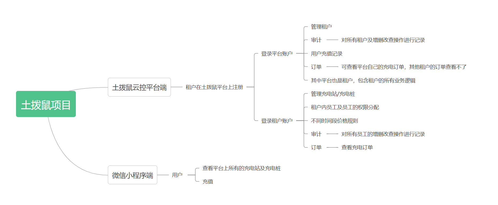

### 如果开源对你有帮助，也很希望得到你的鼓励，右上角Star🌟，等你点亮！

  ------------------------------------------------------------------


### 交流+V：lucy2188687859


  ------------------------------------------------------------------


# 土拨鼠充电系统

## ✍介绍

土拨鼠开源充电系统是一套包含云平台、小程序和后台的充电设备管理系统。

云平台技术涉及：vue3+vite+ts+Element Plus
多租户、权限、审计、充电站/充电桩管理、订单管理，价格规则，充值等

小程序使用 Uniapp 开发，为电动汽车用户提供充电服务，包括登录、注册、查找充电站、充电桩信息、在线充电、订单查询、个人中心等多个功能。

后台使用 Go 语言开发，使用 goframe2 框架和 sqlite 文件数据库。

效果展示


## 演示地址

管理台：https://7483f88q46.goho.co

小程序：


## 源码目录

```
front-manager: 前端管理台
front-mini-programe: 前端小程序
backup: 后端
```
  ------------------------------------------------------------------
# 一、土拨鼠充云平台使用步骤
## 1、使用说明
#### 使用pnpm包管理工具
1、pnpm安装指令：
```
npm i -g pnpm
```
2、安装依赖
```
pnpm install
```
3、启动
```
pnpm run dev
```
4、构建生产环境
```
pnpm run build
```
5、访问
```
平台/租户管理员：土拨鼠充电公司
账户：admin    密码：admin
```

## 2、功能介绍

### 1、设备管理包含充电站管理和充电桩管理
1.1、充电站管理：
租户可以查看充电站列表，每个站点可以进行地图查看
1.2、充电桩管理：
可以查看充电站下所有充电桩信息，并对充电桩进行增删改查

### 2、系统设置
2.1、用户管理：
用户展示，用户余额充值
2.2、租户管理：
展示平台上注册的租户
2.3、角色管理：
租户内员工及员工的权限分配
2.4、充值管理：
展示平台上用户充值记录
### 3、运营管理
3.1、订单管理：
查看平台上用户的充电订单
3.2、价格规则：
租户管理不同时间段价格规则


  ------------------------------------------------------------------
# 二、土拨鼠充电小程序
## 1、使用说明
### ①基本配置
👉HBuilderX + 微信开发者工具
### ②项目启动
HBuilderX点击运行----选择运行到小程序模拟器----微信开发者工具
## 2、功能介绍
简介：三大主要功能（包含：充电、我的、扫码）
### 1、我的（包含登录和个人信息页面）
### 流程：
⭐用户进入小程序后，一键点击登录，获取用户信息，展示个人中心页面
### 2、充电（包含充电站/充电桩信息/充电/充电订单等页面）
### 流程：
⭐用户登录后可以查看完整的充电站点数据，包括附近站点所属的公司、距离以及站点路况。点击充电站后，可以查看各充电桩的状态，并且针对空闲中的充电桩进行连接充电。同时，还可以对充电时长进行设置，查看不同时间段的收费标准。充电完成后，用户可以查看充电订单并了解充电进展。
### 3、扫码
### 流程
⭐根据桩上的设备二维码，可以扫码连接充电


