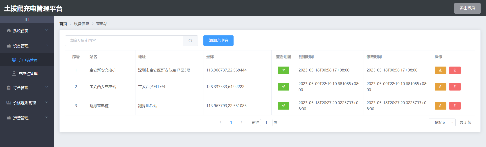

# 土拨鼠充电系统

# 介绍
土拨鼠充电系统开源的充电系统，包含管理台，小程序，后台源码。

土拔鼠充电管理平台是一款用于管理充电桩和相关设备的系统，系统主要包括设备管理、订单管理、价格规则管理、运营管理和数据分析等模块。

土拔鼠充电小程序是一款为电动汽车用户提供充电服务的开源软件，包含登录、注册、查找充电站、充电桩信息、在线充电、订单查询、个人中心等多个功能。

效果展示




## 演示地址
管理台：https://7483f88q46.goho.co

小程序：

这是一个段落。


## 目录说明

```
front-manager: 前端管理台
front-mini-programe: 前端小程序
backup: 后端
```

# 一、土拨鼠充电桩管理系统使用步骤
## 1、使用说明
1、安装依赖
```
npm install 或 yarn install
```
2、启动
```
npm run serve 或 yarn serve
```
3、构建生产环境
```
npm run build 或 yarn build
```
4、访问
```
账户: admin 密码: admin
```
## 2、功能介绍
### 1、充电设备包含充电站管理和充电桩管理
1.1、充电站管理：
👉可以查看充电站列表，每个站点可以进行地图查看

1.2、充电桩管理：
👉可以查看充电站下所有充电桩信息，并对充电桩进行增删改查

### 2、订单管理
👉可以搜索查看充电订单，修改订单状态和价格

### 3、充电价格规则管理
👉不同时间区间展示不同的价格，并对充电价格进行添加、修改和删除

### 4、运营管理包含用户中心管理和用户充值
4.1、用户中心管理
👉展示当前所有用户数据，并对用户数据进行增删改查

4.2、充值页面
👉选择用户进行充值
## ------------------------------------------------------------------
# 二、土拨鼠充电小程序
## 1、使用说明
### ①基本配置
👉HBuilderX + 微信开发者工具
### ②项目启动
HBuilderX点击运行----选择运行到小程序模拟器----微信开发者工具
## 2、功能介绍
### 1、个人中心（包含登录和个人信息页面）
### 流程：
⭐用户进入小程序先进行登录，如果是新用户先进行注册，注册成功后再一键登录；个人中心页面会根据token来按需展示，用户登录后有token展示个人信息页面，无token则展示登录页面
#### 1.1、登录：
👉用户进入页面先进行登录
#### 1.2、注册
👉新用户需要进行注册（备注：手机号可以随意填写，并不会真的发验证码，验证码只能输666666）
#### 1.3个人信息页面
👉注册后个人中心展示个人信息页面
### 2、充电（包含充电站/充电桩信息/充电/充电订单）
### 流程：
⭐展示充电站列表数据，点击对应充电站点可展示充电桩数据，针对空闲的充电桩可进行充电操作，查看此时间段收费标准，充电时常设置等，充电完成后也可查看充电订单（包含充电中及已完成订单）
#### 2.1、充电站
👉登录成功后跳转到充电页面，展示充电站点数据

#### 2.2、充电桩
👉点击充电站，可以查看充电站点下的充电桩

#### 2.3、充电
👉点击充电桩内状态为空闲中的设备编号，可连接充电，可查看此时间段收费标准，充电时常设置等

#### 2.4、充电订单
👉充电完成后可查看充电订单（包含充电中及已完成订单）


