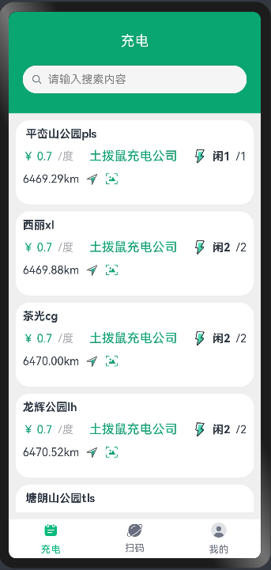

### 如果开源对你有帮助，也很希望得到你的鼓励，右上角Star🌟，等你点亮！

  ------------------------------------------------------------------


### 交流+V：lucy2188687859


  ------------------------------------------------------------------


# 土拨鼠充电系统

## ✍介绍

土拨鼠开源充电系统是一套包含鸿蒙App、微信小程序、云平台和后台的充电设备管理系统。

鸿蒙App使用Api9+Stage模式+ArkTS+ArkUI开发，包含登录、注册、充电站列表、充电桩信息、在线充电、订单查询、个人中心等多个功能。

小程序使用 Uniapp 开发，为电动汽车用户提供充电服务，包括登录、注册、查找充电站、充电桩信息、在线充电、订单查询、个人中心等多个功能。

云平台技术涉及：vue3+vite+ts+Element Plus 多租户、权限、审计、充电站/充电桩管理、订单管理，价格规则，充值等。

后台使用 Go 语言开发，使用 goframe2 框架和 sqlite 文件数据库。


## 演示地址

管理台：https://7483f88q46.goho.co

小程序：


## 源码目录

```
front-manager: 前端管理台
front-mini-programe: 前端小程序
backup: 后端
```
  ------------------------------------------------------------------

## 一、鸿蒙-HarmonyOs 4.0-土拨鼠充电App
### 项目文件夹：TbsHarmonyOS
### 软件架构：
1.开发语言：Api9+Stage模式+ArkTS+ArkUI
2.开发工具：DevEco Studio
3.项目运行：项目在开发工具中启动，效果可Preview 预览或模拟器或真机调试，具体操作可查看此文章https://blog.csdn.net/weixin_71403100/article/details/136150011?spm=1001.2014.3001.5502
### 项目说明：
这是一个鸿蒙开发的充电App，开发语言是ArkTs，目前已实现以下功能
### 已实现功能：
1.登录(下拉选择租户)+注册
2.充电页：充电站列表【点击每个站点查看充电桩详情】、充电桩详情【编号+状态+是否可充电】、充电中、充电列表
3.个人中心页：个人头像+昵称，充电余额，充电订单，功能区，退出登录等
4.扫码：（此功能暂未实现）
### 项目截图：





## 二、微信小程序-土拨鼠充电小程序
### 项目文件夹：front-mini-programe
### 软件架构：
1.开发语言：vue3+uniapp
2.开发工具：HBuilderX + 微信开发者工具
3.项目运行：HBuilderX点击运行--选择运行到小程序模拟器--微信开发者工具
### 项目说明：
这是一个uniapp开发的充电微信小程序，开发语言是js，目前已实现以下功能
### 已实现功能：
1.充电：充电站列表【附近站点+距离】、充电桩信息【编号+状态+是否可充电】、充电、充电订单等
2.扫码：根据桩上的设备二维码，可以扫码连接充电
3.我的：登录、个人信息页面【头像+昵称、充电余额、充电订单、功能区、退出登录】
### 项目截图：


## 三、土拨鼠充电云平台
### 项目文件夹：front-manager
### 软件架构：
1.开发语言：vue3+vite+Ts+Element Plus 
2.开发工具：VS Code
3.项目运行：使用pnpm包管理工具
```
1、pnpm安装指令：npm i -g pnpm
2、安装依赖：pnpm install
3、启动：pnpm run dev
4、构建生产环境：pnpm run build
5、访问：
平台/租户管理员：土拨鼠充电公司
账户：admin    密码：admin
```
### 项目说明：
这是一个vue3+ts开发的充电云平台，目前已实现以下功能
### 已实现功能：
1.设备管理：充电站【站点列表+地图查看】、充电桩【站点下桩信息+充电桩增删改查】
2.系统设置：用户管理【用户展示+余额充值】、角色管理【权限分配】，租户管理、充值管理
3.运营管理：订单管理【用户充电订单】、价格规则【不同时段价格】
### 项目截图：


## 四、后台
### 项目文件夹：backup
### 软件架构：
后台使用 Go 语言开发，使用 goframe2 框架和 sqlite 文件数据库。
### 说明：
backup文件夹内的README文件包含项目介绍/项目启动/代码结构等
