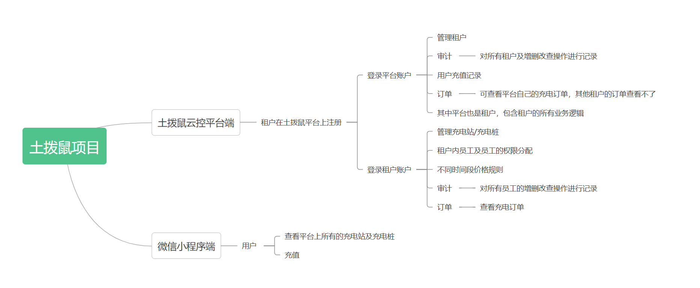
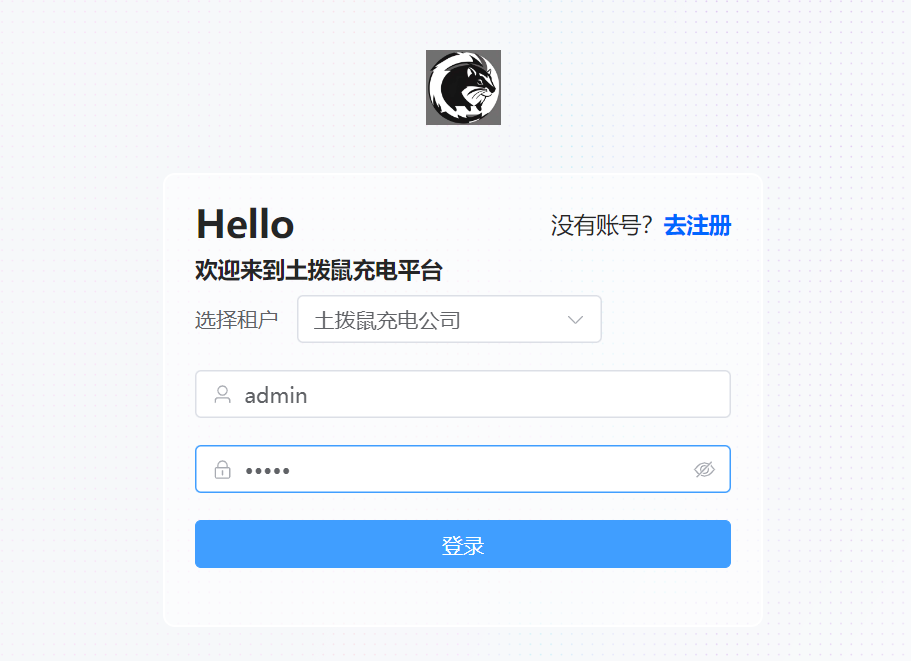
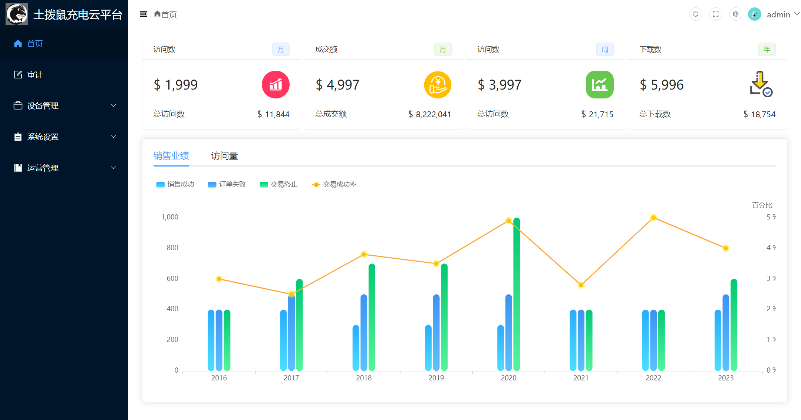
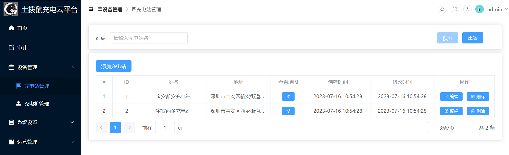
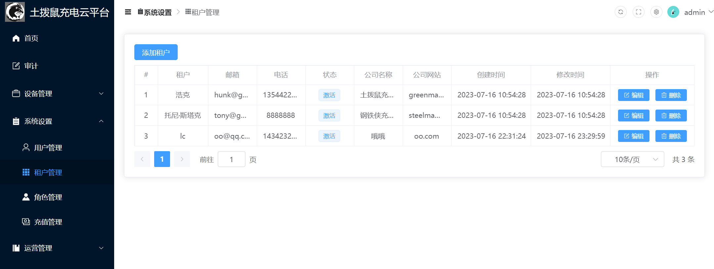
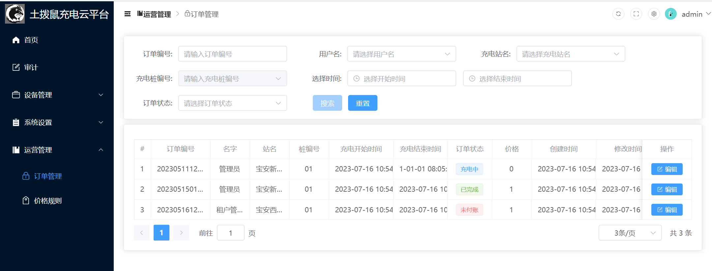

### 一、项目介绍
云平台功能包含多租户、权限、审计、充电站/充电桩管理、订单管理，价格规则，充值等
技术涉及：vue3+vite+ts+Element Plus
### 二、功能概览

### 三、功能介绍（部分截图）





### 三、部署启动说明
使用pnpm包管理工具
1、pnpm安装指令：
```
npm i -g pnpm
```
2、安装依赖
```
pnpm install
```
3、启动
```
pnpm run dev
```
4、构建生产环境
```
pnpm run build
```
5、访问
```
平台/租户管理员：土拨鼠充电公司
账户：admin    密码：admin
```