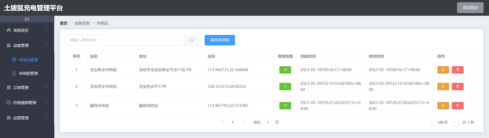
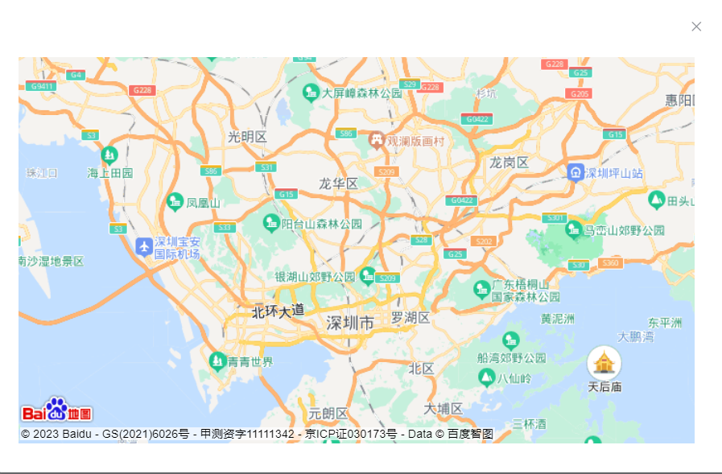
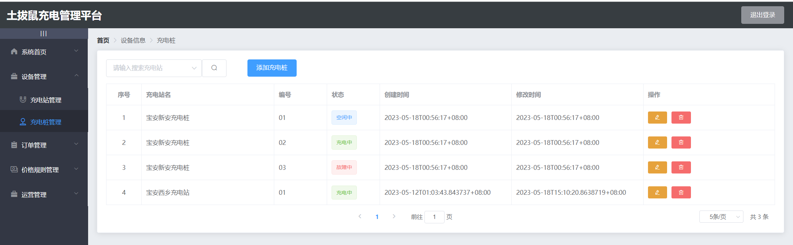
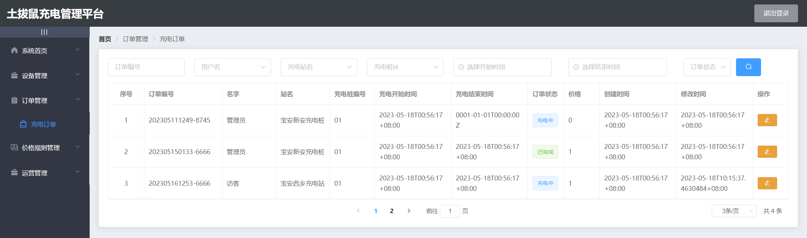
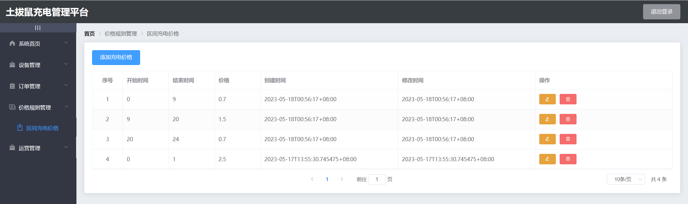
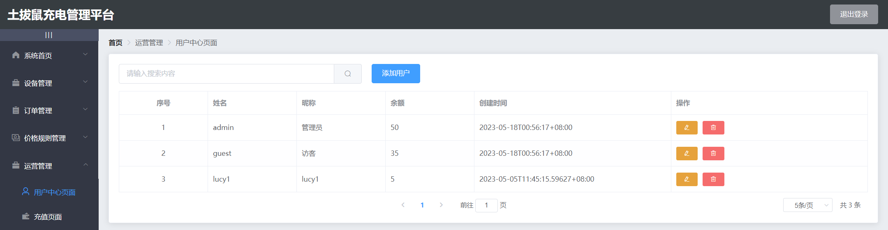
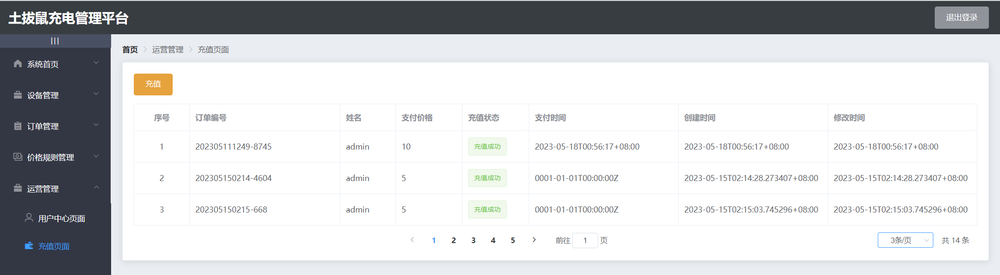

### 一、项目介绍

土拔鼠充电管理平台是一款用于管理充电桩和相关设备的系统，系统主要包括设备管理、订单管理、价格规则管理、运营管理和数据分析等模块

### 二、功能介绍
#### 1、充电设备包含充电站管理和充电桩管理
1.1、充电站管理：
👉可以查看充电站列表，每个站点可以进行地图查看


1.2、充电桩管理：
👉可以查看充电站下所有充电桩信息，并对充电桩进行增删改查

#### 2、订单管理
👉可以搜索查看充电订单，修改订单状态和价格

#### 3、充电价格规则管理
👉不同时间区间展示不同的价格，并对充电价格进行添加、修改和删除

#### 4、运营管理包含用户中心管理和用户充值
4.1、用户中心管理
👉展示当前所有用户数据，并对用户数据进行增删改查

4.2、充值页面
👉选择用户进行充值


### 三、部署启动说明
1、配置淘宝镜像是为了在使用npm安装包时，可以加快下载速度并减少下载失败的情况
```
1、获取npm当前的registry地址：npm config get registry

2、将registry地址更改为淘宝源：npm config set registry https://registry.npm.taobao.org/

3、通过npm config get registry验证后是：https://registry.npm.taobao.org/  表示成功更改为淘宝源
```
2、安装依赖
```
npm install 或 yarn install
```
3、启动
```
npm run serve 或 yarn serve
```
4、构建生产环境
```
npm run build 或 yarn build
```
5、访问
```
账户: admin 密码: admin
```
### 四、登录、鉴权
1、登录
--发起登录请求时，存储token；---在请求拦截器里获取token，并在header头中携带token
2、鉴权
--使用refresh_token将token转行成jwt格式，并在请求拦截器中书写鉴权逻辑

### 项目目录
```
|--public # ico图标,静态页面,项目打包的时候webpack不会编译这个文件夹
|--src # 包含项目的源代码
|  |--api # 请求接口
|  |--assets # 存放静态资源，例如图片、字体等
|  |--mock # mock数据
|  |--router # 存放Vue Router路由配置
|  |--views # 路由组件
|  |--App.vue # 根组件
|  |--main.js # 入口文件，用于初始化Vue实例并渲染根组件
|--babel.config.js # Babel的配置文件
|--jsconfig.json # 指定了项目中使用的JavaScript的编译选项和代码检查规则
|--package-lock.json # 用于锁定整个依赖树中依赖包的版本号
|--package.json # 该文件是项目的配置文件，包含了项目名称、依赖模块列表等信息
|--vue.config.js # 配置文件
```
### Customize configuration

See [Configuration Reference](https://cli.vuejs.org/config/).
