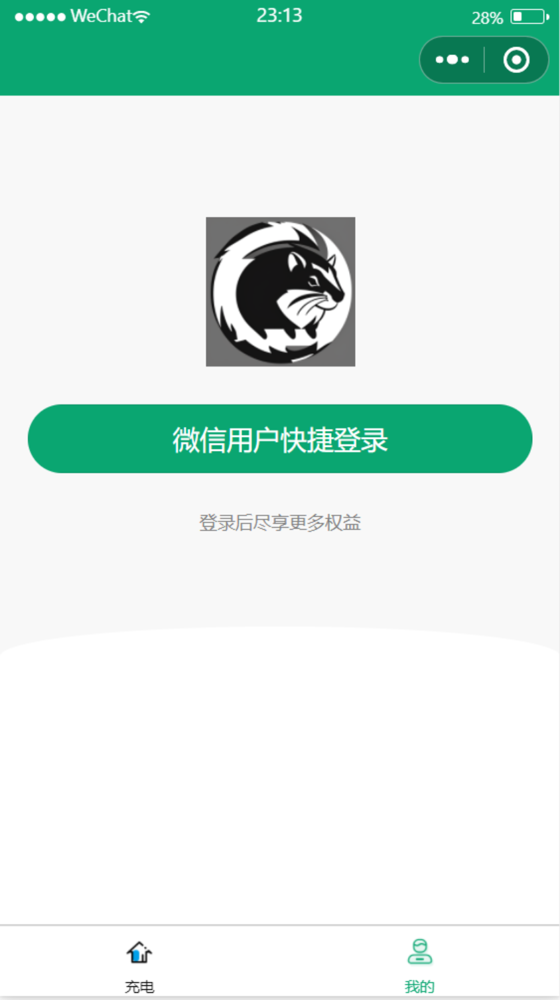
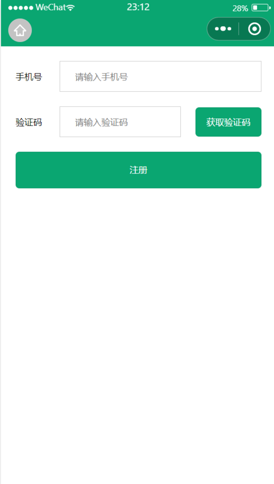
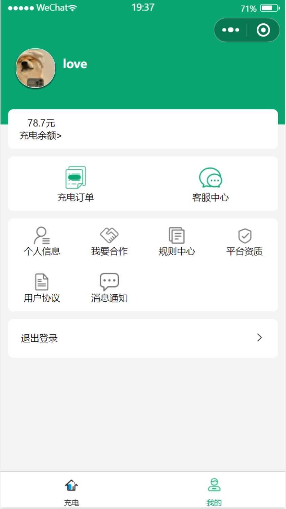
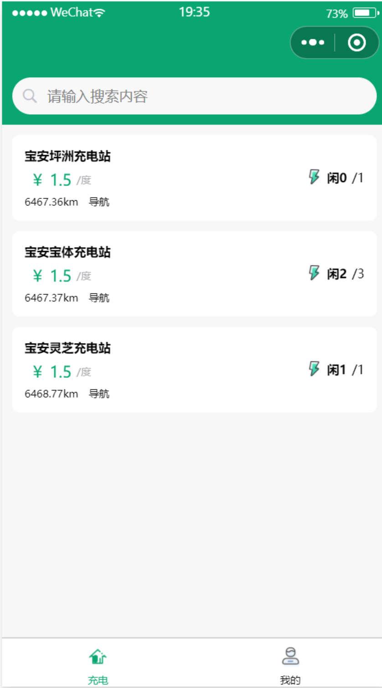
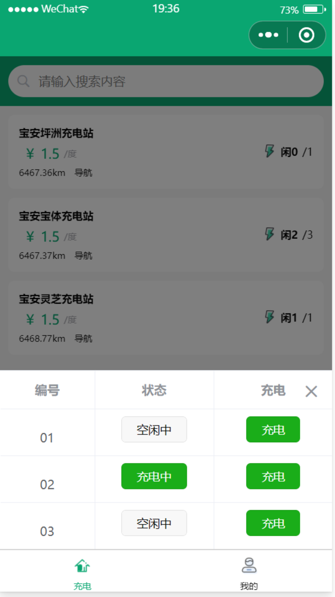
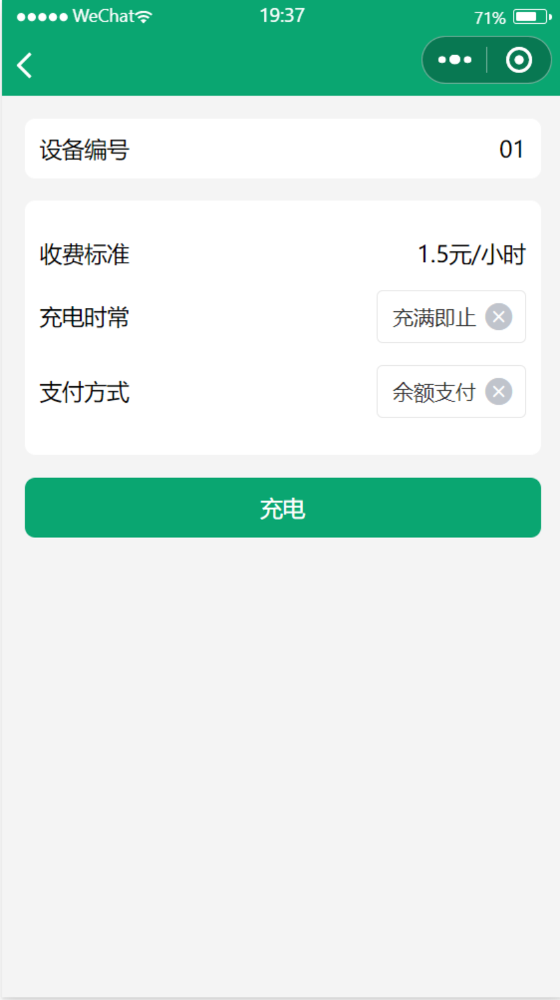
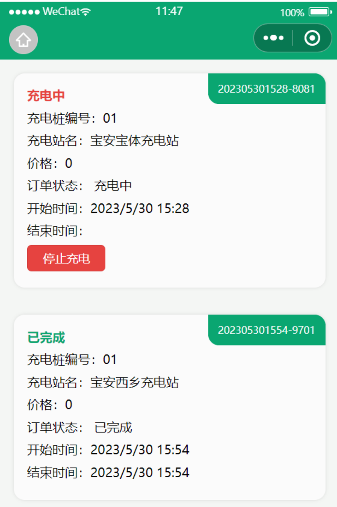

# 一、项目介绍

⭐土拔鼠充电小程序是一款为电动汽车用户提供充电服务的开源软件，包含登录、注册、查找充电站、充电桩信息、在线充电、订单查询、个人中心等多个功能。操作简便易懂，支持多种充电桩类型，满足用户出行需求。

# 二、功能介绍
## 1、个人中心（包含登录和个人信息页面）
### 流程：
⭐用户进入小程序先进行登录，如果是新用户先进行注册，注册成功后再一键登录；个人中心页面会根据token来按需展示，用户登录后有token展示个人信息页面，无token则展示登录页面
#### 1.1、登录：
👉用户进入页面先进行登录


#### 1.2、注册
👉新用户需要进行注册（备注：手机号可以随意填写，并不会真的发验证码，验证码只能输666666）


#### 1.3个人信息页面
👉注册后个人中心展示个人信息页面


## 2、充电（包含充电站/充电桩信息/充电/充电订单）
### 流程：
⭐展示充电站列表数据，点击对应充电站点可展示充电桩数据，针对空闲的充电桩可进行充电操作，查看此时间段收费标准，充电时常设置等，充电完成后也可查看充电订单（包含充电中及已完成订单）
#### 2.1、充电站
👉登录成功后跳转到充电页面，展示充电站点数据


#### 2.2、充电桩
👉点击充电站，可以查看充电站点下的充电桩


#### 2.3、充电
👉点击充电桩内状态为空闲中的设备编号，可连接充电，可查看此时间段收费标准，充电时常设置等


#### 2.4、充电订单
👉充电完成后可查看充电订单（包含充电中及已完成订单）



# 三、快速启动
## 1、基本配置
👉HBuilderX + 微信开发者工具
## 2、项目启动
HBuilderX点击运行----选择运行到小程序模拟器----微信开发者工具

### 备注：
👉建议在编码前先了解uniapp框架的基本使用方法和开发规范。


# 四、项目目录
```
┌─.hbuilderx  #  是HBuilderX集成开发环境（IDE）的配置文件夹，用于保存HBuilderX的一些配置信息和插件设置
|--components  #  符合vue组件规范的uni-app组件目录
|--md_static  #  存放README.md文件的静态图片
|--pages  #  业务页面文件存放的目录
|--static  #  存放应用引用的本地静态资源（如图片、视频等）的目录
|--store  #  用于vuex数据管理
|--subpkg  #  小程序分包
|--uni_modules  #  用于存放uni-app平台通用的组件和插件
|--unpackage  #  用于存放编译后的小程序代码和资源文件
|--utils  #  用于存放网络请求的文件夹
|--App.vue  #  应用配置，用来配置App全局样式以及监听
|--index.html  #  是uni-app小程序的入口文件，位于小程序项目的根目录下
|--main.js  #  用于初始化小程序的一些配置和全局变量
|--manifest.json  #  用于配置小程序的基本信息和页面路径等
|--pages.json  #  配置页面路由、导航条、选项卡等页面类信息
└─uni.scss  #  uni-app内置的常用样式变量

```


## 结语
欢迎一起探讨，如果你觉得还可以，可以给我点一个star
